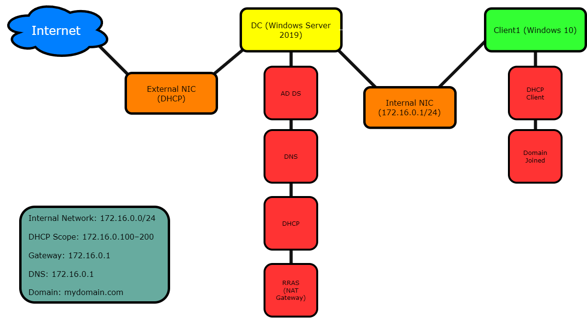
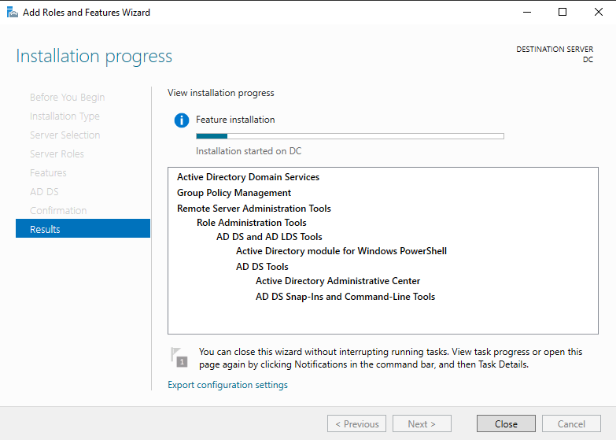
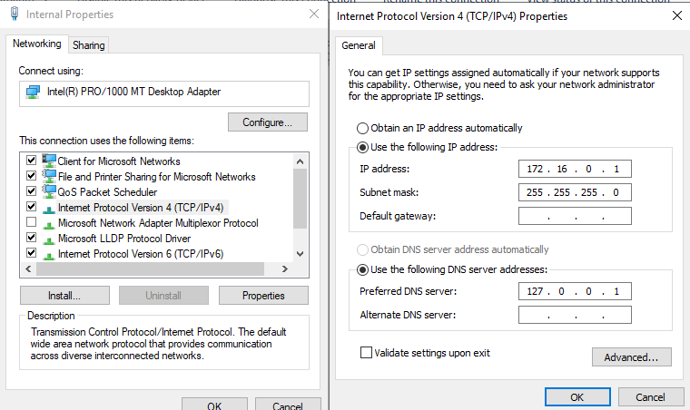
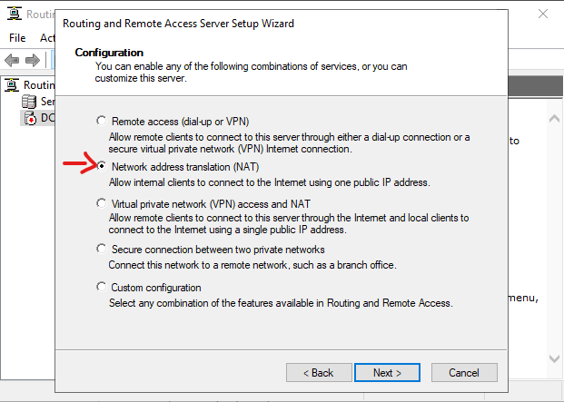
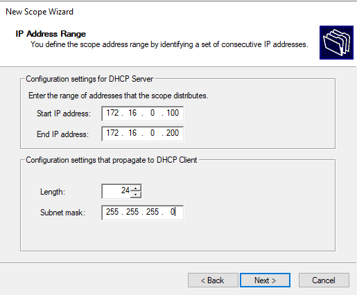
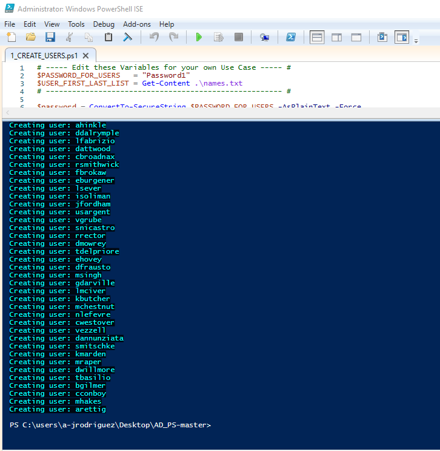
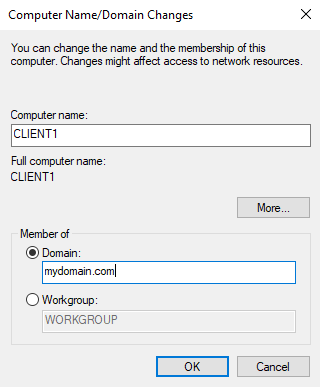
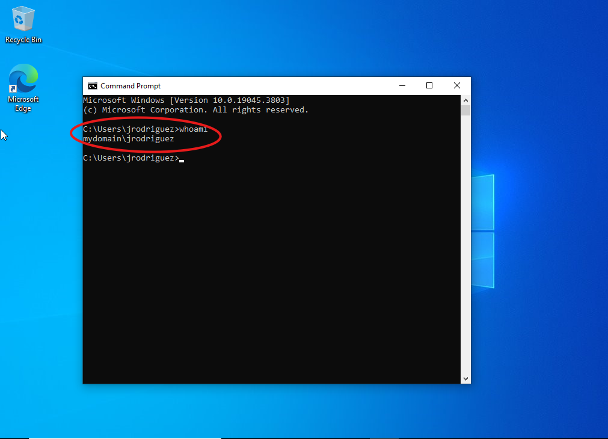
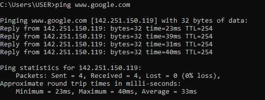

# Enterprise Active Directory & Network Infrastructure Lab

## Overview
Designed and implemented a multi-VM Windows enterprise environment to simulate core infrastructure services used in real-world networks. The lab environment includes a Windows Server 2019 Domain Controller and a Windows 10 client system operating within an isolated internal network.

Configured centralized identity management, dynamic IP allocation, DNS resolution, and network routing to support domain authentication and external connectivity. PowerShell was utilized to automate user provisioning at scale.

---

## Lab Architecture

---

## Technologies Used
- Windows Server 2019
- Windows 10
- Active Directory Domain Services (AD DS)
- DNS
- DHCP
- Routing and Remote Access (RRAS / NAT)
- PowerShell
- VirtualBox

---

## Key Responsibilities

- Deployed and configured a Windows Server 2019 Domain Controller
- Implemented Active Directory Domain Services (AD DS) with a new forest (mydomain.com)
- Configured DNS for internal name resolution within the domain
- Designed and implemented a private network (172.16.0.0/24)
- Configured DHCP with scoped address allocation (172.16.0.100–200)
- Implemented NAT using RRAS to allow internal clients to access external networks
- Managed user accounts, organizational units, and group memberships within Active Directory
- Automated bulk user provisioning using PowerShell scripts and structured input data
- Integrated a Windows 10 client into the domain environment
- Validated authentication, network configuration, and external connectivity

---

## Environment Configuration

### Domain Controller
- Hostname: DC  
- Domain: mydomain.com  
- Internal IP: 172.16.0.1/24  
- DNS: 127.0.0.1  
- Roles:
  - Active Directory Domain Services (AD DS)
  - DNS
  - DHCP
  - RRAS (NAT Gateway)

### Network Configuration
- Internal Network: 172.16.0.0/24  
- DHCP Scope: 172.16.0.100 – 172.16.0.200  
- Default Gateway: 172.16.0.1  
- DNS Server: 172.16.0.1  

### Client System
- Hostname: CLIENT1  
- Operating System: Windows 10  
- DHCP-enabled network configuration  
- Successfully joined to mydomain.com  

---

## PowerShell Automation
Implemented PowerShell-based automation to provision user accounts in bulk using external data sources. This approach reflects common enterprise practices for scalable user management and reduces manual administrative overhead.

Included files:
- `scripts/1_CREATE_USERS.ps1`
- `scripts/Generate-Names-Create-Users.ps1`
- `scripts/names.txt`

---

## Validation & Testing

- Verified successful deployment of Active Directory Domain Services and domain creation  
- Confirmed DNS resolution within the domain environment  
- Validated DHCP address assignment and proper lease distribution  
- Confirmed correct gateway and DNS settings on the client system  
- Successfully joined client machine to the domain  
- Authenticated using domain user credentials  
- Verified internal network communication between client and Domain Controller  
- Confirmed external network access from the client via NAT configuration  

---

## Screenshots

### Active Directory Deployment

### Server Network Configuration

### NAT Configuration (RRAS)

### DHCP Scope Configuration

### PowerShell User Provisioning

### Domain Integration

### Authentication Validation

### Network Connectivity Verification

---

## Summary
This lab demonstrates hands-on experience with core Windows infrastructure services, including identity management, network configuration, and system integration. The environment reflects a simplified enterprise setup and highlights practical skills relevant to IT support, system administration, and foundational cybersecurity roles.
